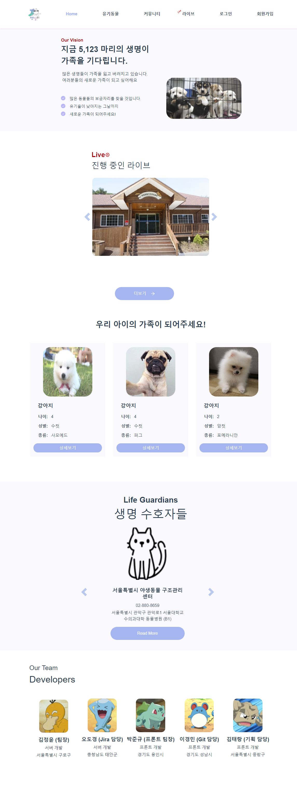

# 📰README --petmily

### ✏️ 소개

- 프로젝트 기간 : *2021.7.12(월) ~ 2021.8.20(금)*

- 개발자 : 박준규(리더), 이경민(git 담당), 김태랑(스타일링)

- 와이어프레임 : Figma

- 로고: 미리캔버스

- 목표 :

  - vue3 구조 이해

  - 유기 동물 라이브를 통해 입양 활성화

  - 프론트엔드 개발자로서 백엔드와의 원활한 소통을 통한 성공적인 프로젝트 경험 쌓기
  
  - ## 아무거나 적어주세요... 떠오르는게 없어요

#### 

### ✏️ 피그마

### ✏️ 구성 화면 -> 이미지를 넣는게 좋을까요 빼는게 좋을까요??

- Home.vue : 메인 화면 

  - 사이트의 목표

  - 진행중인 라이브 방송
  - 유기동물 목록
  - 유기동물 보호 단체
  - 개발자들

- shelter

  - 보호소 정보 및 지도, 등록한 동물 정보를 conponents로 사용하여 보호소의 상세 정보를 보여줌

- live

  - 방송정보

- animal

  - 유기동물 목록
  - 필터와 검색 기능을 구현
  - 각 동물에 대한 디테일 페이지 구현

- accounts

  - 기관 및 개인 회원으로 구분하여 가입, 비밀번호 찾기, 마이페이지등을 구현

  

------------

### 과정 및 느낀 점

##### 기능 별 주요 컴포넌트들

Main

> Navbar.vue
>
> - 어느 정도 이하로 폭이 줄어들면 메뉴 버튼으로 숨기는 기능을 구현하지 못해서 아쉬웠다.

Home

> Home.vue

Accounts

> AgencyForm.vue
>
> - 기관 코드 검색 모달을 구현하며, 검색결과를 form의 value로 바로 넣는 기능을 학습할 수 있었다. 
> - 사진 등록 기능을 구현하며, 사용자가 업로드한 파일을 처리하는 방법을 학습할 수 있었다.
>
> Login.vue
>
> - radio button에서 value를 v-bind(:)해 주어야 실시간으로 바인딩된 값으로 변경되는 것을 알게 되었다. 이것을 해주지 않아 한번 값을 바꾸면 다시 바꾸지 못하는 문제가 있었다.
> - input 태그 다음에 button 태그가 있으면 input에서 엔터키 입력시 button 태그에 v-on(@) 된 메서드가 실행되는 것을 알게 되었다. 비밀번호 입력 후 엔터 키 입력시 `@keyup.enter`로 연결한 로그인 메서드 대신에 button 태그에 `@click`으로 연결되어 있던 비밀번호 찾기 메서드가 실행되는 문제가 있었다. button 태그를 a 태그로 변경하여 해결하였다.
>
> ProfileAgency.vue
>
> > AgencyRegisterAnimal.vue
> >
> > - v-for 안에서 모달을 사용하는 방법에 대해 학습할 수 있었다. 모달을 여는 button의 data-bs-target 속성과 모달의 최상위 태그의 id 속성에 v-bind(:)을 사용하여 v-for의 항목마다 각각 사용할 수 있었다. `:data-bs-target="'#animal' + animal.no", :id="'animal' + animal.no"` 

Animal

> AnimalDetail.vue
>
> AnimalList.vue
>
> - 필터 기능, 카드 기능, 즐겨찾기 기능, 페이지네이션 기능 등 중요한 기능들이 다수 포함된 종합선물세트같은 페이지였다. 그런 만큼 구현하는데 가장 오랜 시간과 노력을 투자하였다.
>
> - 부모-자식 컴포넌트 간의 상호작용이 익숙치 않아 한 컴포넌트에 모든 구성요소를 구현하였다. 기능은 성공적으로 구현하였지만 유지보수가 용이하지 못한 코드가 되었다. 
>
> AnimalRegister.vue
>
> - 다중 파일 업로드 구현으로 인해 많은 시간과 노력을 들이게 되었다. 
> - 기관 번호를 받아올 때 처음에는 jwt를 전송하여 response로 받아오는 형태를 취했으나, 여러 개의 axios를 사용하며 여러 문제들이 발생하여 localstorage에 기관 번호를 저장하는 방식으로 변경하였다.
>
> > AnimalCarousel.vue
> >
> > - 캐러젤이라는 컴포넌트가 얼마나 까다롭게 구는 컴포넌트인지 느낄 수 있었다. 태그 구조를 조금만 틀려도 오작동하기 일쑤였고, 스타일링 및 크기조절 또한 일반적인 개체들과는 다르게 의도대로 잘 적용되지 않았다. 결국 픽셀값을 주어 고정된 크기를 사용하게 해서 아쉬웠다.

Community

> BoardDetail.vue
>
> Community.vue
>
> > CommunityPagination.vue
> >
> > - 부모 컴포넌트에서 자식 컴포넌트에게 데이터를 내려주고(props), 자식 컴포넌트에서 부모 컴포넌트에게 이벤트를 올려주는(emit) 방식에 대해 학습할 수 있었다. 자식 컴포넌트인 페이지네이션에서 부모의 현재 페이지의 값을 바꿔주려고 하였는데, 직접 바꾸려고 시도하다 잘못된 방식인 것을 깨닫고 이벤트를 통하여 부모 컴포넌트에서 변경하였다. 

Live

> Live.vue
>
> LiveList.vue
>
> LiveRoom.vue

Shelter

> ShelterDetail.vue

### 총평

경민: 처음에는 익숙하지 않았던 vue.js, 그것도 처음 다뤄보는 vue 3.0 버전을 이용하게 되어 걱정이 앞섰다. 하지만 코드와 팀원들, 공식 문서, 구글과 부대끼며 열심히 코딩한 끝에 이제는 내가 원하는 기능들을 생각한 대로 어느 정도 구현이 가능한 수준까지 왔다고 생각한다. 하지만 클린 코딩과 스타일링은 부족하다고 생각하고, 더 많은 경험을 쌓아야겠다는 생각을 하게 되었다. 프론트엔드 개발이란 어떤 것인지 느낄 수 있는 좋은 경험이 되었다.

